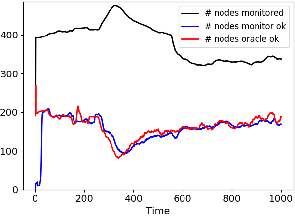

# Adaptive distributed monitors of spatial properties for cyber-physical systems

This is the project repository for the case study
 presented in a manuscript submitted to a journal.

## Structure of the repository

The project has the standard structure of Maven/Gradle projects.

* `./build.gradle` contains the build definition and the tasks for compiling and packaging the application
* `./src/main/protelis/monitoringAndDispersal.pt` contains the **source code of the case study**
* `./src/main/yaml/monitoringAndDispersalWithAPs.yml` contains the **configuration of the Alchemist simulation**
* `./plotter.py` is a script that can be used to plot data produced by Alchemist, according to a configuration file such as `./plot.yml`

## Reproducing the experiments: how-to

NOTE: this may take a few hours.

The simulations used to produce the results shown in the paper can be run with the following command:

```bash
$ git checkout paper-experiments
$ ./gradlew paper-experiments
```

Once data files (which are in CSV format) are generated in directory `data/`, you can use script `plotter.py` to create plots.

```bash
# ./plotter.py <plotConfigFile> <dir> <baseFilepathRegex> <baseFilename>
$ ./plotter.py plot.yml data .*paper-experiments.* results
```

## Pictures in the paper

#### Figure 5

- Representation of the simulated scenario, as a network of devices in the city of Vienna:
 black dots denote (the smartphones of) people corresponding to the GPS traces from the Vienna city marathon dataset;
 gray links represent connectivity (i.e., the neighbouring relationships);
 yellow, orange, and red overlays represent increasing levels of crowding;
 blue squares denote safe places (these are real locations of hospital facilities in Vienna);
 small, light blue squares represent access points.


#### Figure 6

- These zoomed snapshots of the scenario are meant to illustrate the property checking. We assume safe areas are only south of the river,
and there are no paths that circumvent the Reichsbrucke bridge shown in the picture.
- (A): The red-circled node has every path to a safe node hindered by a dangerous, crowded area---which is red-coloured to denote its collective failure in satisfying the property. The cyan circles denote nodes able to reach safety.
- (B): The red-circled node walks away, detaching from the network. All the remaining nodes can reach a safe area (not shown) by passing across the bridge: therefore, the crowded area satisfies the property.


#### Figure 7 (simulation results)


- Number of devices that perceive a dangerous (red line) or
moderate (orange line) overcrowding, monitored (black line),
and following dispersal advices (green line).



- Number of monitored devices (black line) that satisfy the property according to the oracle (red line) and the monitor (blue line).


- Number of monitored devices (black line) for which the oracle and the monitor provide a different response (red line).


- Detail of the error in terms of the number of devices
 providing false positives (magenta line) and false negatives (orange line).

## Contacts

* Roberto Casadei: roby [dot] casadei [at] unibo [dot] it
